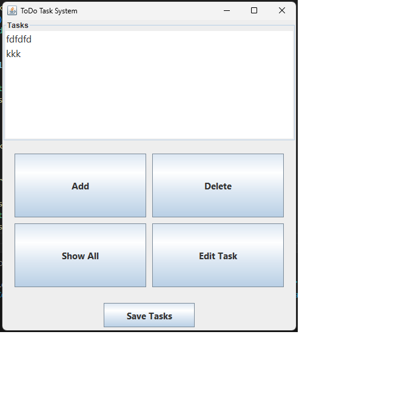

# ToDoTaskGUI - Java Swing Task Manager

**ToDoTaskGUI** is a simple desktop application built with Java Swing that allows users to manage their tasks through a graphical user interface. Users can add, edit, delete, view, and save their tasks to a local file (`tasks.txt`).

## Features

- 📝 **Add Tasks**: Enter new tasks using a dialog input.
- 🗑️ **Delete Tasks**: Select and remove tasks with a confirmation prompt.
- ✏️ **Edit Tasks**: Modify existing tasks easily.
- 📂 **Show All**: Load tasks from a file (`tasks.txt`).
- 💾 **Save Tasks**: Save the current list of tasks to the file.

# ToDoTaskGUI - Java Swing Task Manager

**ToDoTaskGUI** is a simple desktop application built with Java Swing that allows users to manage their tasks through a graphical user interface.

## 📸 Screenshot



## How to Run

1. **Ensure you have Java installed** (Java 8 or later).
2. **Compile the program:**

```bash
javac ToDoTaskGUI.java
Run the program:

bash
Copy
Edit
java ToDoTaskGUI
File Structure
ToDoTaskGUI.java - Main source file.

tasks.txt - Task data saved to this file.

Notes
Tasks are saved locally in the same directory as tasks.txt.

On first run, if tasks.txt doesn't exist, a message will notify you and the task list will be empty.

License
This project is open-source and free to use for educational or personal projects.

Built with 💻 using Java Swing.

yaml
Copy
Edit

---

Let me know if you’d like to include a license, contributor section, or add images!
